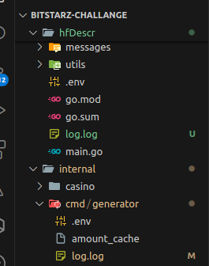

### To provision services run:
- ./scripts/provision_rabbitmq.sh

Running the provision_rabbitmq.sh should call all the other scripts to provision everything

You will need goose installed for scripts to work:

- go install github.com/pressly/goose/v3/cmd/goose@latest

### Running all services:

The above gif is not how the scripts work because scripts will run the services in background 

You can find the logs of the services in `log.log` files in each service directory:

